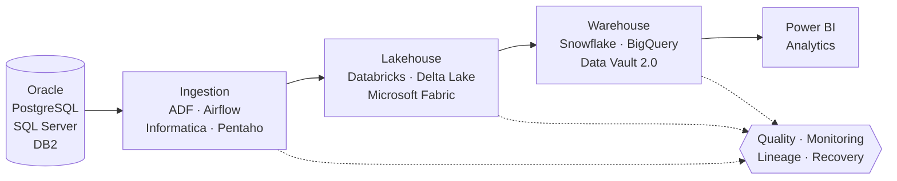

 

<!-- Optional, only if you want to signal availability:

-->
 

  

 

## 👋 About

Senior Data Engineer with **7+ years** designing, migrating and operating data platforms across **Oracle, PostgreSQL, SQL Server and IBM DB2**, with cloud analytics on **Azure Databricks, Microsoft Fabric, Snowflake and BigQuery**.

I treat **data quality, performance and recoverability as first-class concerns**, not afterthoughts.

<table>
<tr>
<td width="50%" valign="top">

**🎯 What I do**
- Design ETL/ELT pipelines and orchestration
- Dimensional and Data Vault 2.0 modeling
- Database administration, tuning and HA/DR
- Lakehouse and warehouse architecture
- Monitoring, data quality and lineage

</td>
<td width="50%" valign="top">

**🏢 Where**
- **Senior Data Engineer**, Dar Al Ber Society (2022 – present)
- **Full Stack Developer**, Dar Al Ber Society (2019 – 2022)
- **B.Sc. Systems Engineering**, Universidad Azteca (2019)

</td>
</tr>
</table>

<!--
IMPACT SECTION: recruiters love numbers. Fill with REAL figures, then uncomment.

## 📈 Selected Impact
| Area | Result |
|------|--------|
| Pipeline performance | Cut nightly load from X hrs to Y min |
| Reliability | Reached XX.X% pipeline success rate |
| Migration | Moved X TB from Oracle to PostgreSQL / Azure |
| Cost | Reduced compute spend by X% |
-->

 

## 🏗️ How I Build Data Platforms

 

## ⚡ Tech Stack

**Databases** 

**Data Platform & Warehousing** 

**Orchestration & ETL** 

**Languages & Modeling** 

**DevOps & Visualization** 

 

## 📊 GitHub Activity

  

 

## 🐍 Contribution Snake

  <picture>
    <source media="(prefers-color-scheme: dark)" srcset="https://raw.githubusercontent.com/imran-imtiaz48/imran-imtiaz48/output/github-snake-dark.svg"/>
    <source media="(prefers-color-scheme: light)" srcset="https://raw.githubusercontent.com/imran-imtiaz48/imran-imtiaz48/output/github-snake.svg"/>
    
  </picture>

 

## 💡 Philosophy

> Good data systems should be **reliable, observable and scalable**.
> I build platforms where **quality, performance and recoverability** are designed in from day one.

 

**Open to conversations about data engineering, database architecture and cloud migration.**
 
<a href="mailto:emraan.imtiaz48@gmail.com">emraan.imtiaz48@gmail.com</a> · <a href="https://linkedin.com/in/imranimtiaz1">LinkedIn</a>

